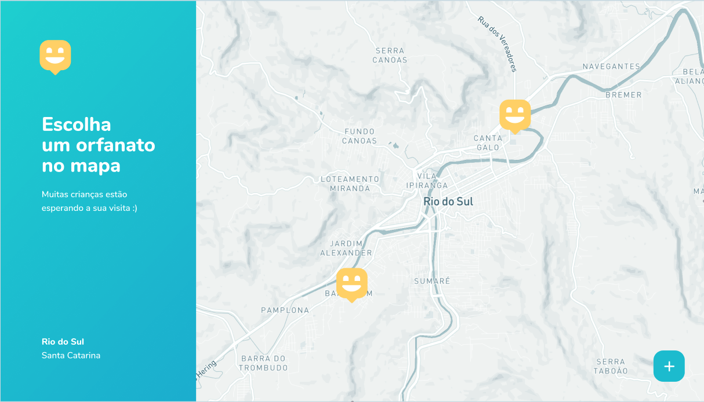
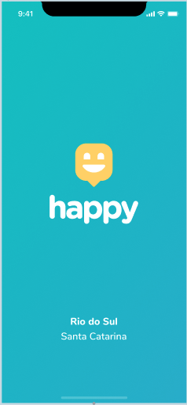
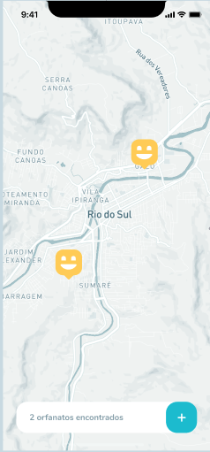

<div align="center">
    
</div>

</br></br>

# Happy
Projeto: Happy<br/>
Descrição: Projeto do NLW Rocketseat de localização de orfanatos. 


</br></br>
## :heavy_check_mark: Índice

- [Sobre](#sobre)
- [Tecnologias Utilizadas](#tecnologias-utilizadas)
- [Resultado](#resultado)
- [Como Usar](#como-usar)


</br></br>
<a id="sobre"></a>
## :bookmark: Sobre
O <strong>Happy</strong> é uma aplicação Web para facilitar o contato entre pessoas e orfanatos.


</br></br>
<a id="tecnologias-utilizadas"></a>
## :books:  Tecnologias Utilizadas

O projeto foi desenvolvido utilizando as seguintes tecnologias:

- [Node.js](https://nodejs.org/en/)
- [ReactJS](https://reactjs.org/)
- [React Native](https://reactnative.dev/)


</br></br>
<a id="resultado"></a>
## :computer: Resultado Web

<h1 align="center">
    
    
</h1>

## :computer: Resultado Mobile

<h1 align="center">
    
    
    
</h1>


</br></br>
<a id="como-usar"></a>
## :pencil: Como usar

- ### **Pré-requisitos**

  - É **necessário** possuir o **[Node.js](https://nodejs.org/en/)** instalado na máquina
  - Também, é **preciso** ter um gerenciador de pacotes seja o **[NPM](https://www.npmjs.com/)** ou **[YARN](https://www.yarnpkg.com/)**.


1. Faça um clone :

```sh
  $ git clone https://github.com/marciommrs/happy.git
```


2. Executando a Aplicação:

```sh

  # Acessar o backend, instalar as denpendências e iniciar
  $ cd backend
  $ yarn install
  $ yarn dev:server

  # Acessar o frontend, instalar as denpendências e iniciar
  $ cd web
  $ yarn install
  $ yarn start

  #Acesse em http://localhost:3000/
  

  # Acessar o frontend, instalar as denpendências e iniciar
  $ cd mobile
  $ yarn install
  $ yarn start
  
  #Instalar o expo-client no celular
  #Acesse em http://localhost:19002/
  #Abrir a câmera e apontar para o QRCode
```